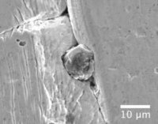

<h3>Welcome!</h3>

Welcome to my website. Here you can find various information on my research in the wide field of cosmochemistry. 

<h3>My Research Interests</h3>

Here is a brief overview of my research interests. More information can soon be found in a seperate project category as well. Feel free [contact](/contact/) me if you have further questions!

<h4>Galactic Chemical Evolution & Stellar Nucleosynthesis</h4>
The Big Bang formed primarily Hydrogen and Helium, however, we clearly live in a world that is dominated by other elements. All terrestrial life forms are carbon based, we breathe oxygen, and we create energy using uranium to just mention a few other crucial elements in everydays life. These elements were all formed by stellar nucleosynthesis over multiple generations of stars and the elements as well as their isotopic composition evolved over time in the galaxy. This evolution is called galactic chemical evolution.

{:style="float: right; margin-right: 0px; margin-top: 6px; margin-left: 0px, margin-bottom: 0px"}
In meteorites we can identify small &mdash; up to micrometer-sized &mdash; grains that did not form in the Solar System but rather formed in the outflow of dying stars. These presolar grains contain the nucleosynthetic fingerprints of their parent star's composition. An image of a large presolar SiC grain pressed into gold is shown in the image on the right. By analyzing various isotopic compositions of major and trace elements in these presolar grains, e.g., using resonance ionization mass spectrometry, we learn the conditions under which the stellar nucleosynthesis took place in the grains' parent star as well as how elements evolved in the galaxy.

<h4>The composition of the early Solar System</h4>
The elemental and isotopic composition of the early Solar System is nothing else but a snapshot of galactic chemical evolution in the solar neighborhood 4.5 billion years ago, i.e., when the Solar System formed. Of special interest to me in the early Solar System are nucleosynthetic anomalies that are inherited from a parent star, as well as short-lived radionuclides. 

For example, it has been shown by measuring excesses in 26Mg that live 26Al, which has a half-life of  0.717 million years, was present when the first Solar System solids formed. The abundance of 60Fe, which has a half life of 2.6 million years, in the early Solar System has been a longstanding debate in the literature, ranging between values that would be consistent with galactic background as well as higher values that would be consistent with an injection event from a supernova just prior to the formation of solids in the solar nebula. We recently showed [(Trappitsch et al., 2018)](https://doi.org/10.3847/2041-8213/aabba9){:target="_blank"} that the "high" 60Fe values reported in the literature do not show excesses in 60Ni due to in situ decay of 60Fe, but rather due to measurement uncertainties of the method that these studies used. A correlated reanalysis of previous measurements from the literature showed that no proof for "high" 60Fe in the early Solar System can be found. We thus concluded that the 26Al was not delivered to the solar nebula by a supernova, since such an event would provide to much 60Fe to be consistent with what was present in the early Solar System.

<h4>The production of cosmogenic nuclides</h4>
Cosmogenic nuclides are produced when high energy particles such as protons strike matter, e.g., a meteoroid in space, and induce spallation reactions. The reaction products are called cosmogenic nuclides. If the production rates of individual cosmogenic nuclides in a given sample are known and the amount of cosmogenic nuclides present in the same sample can be measured, an exposure time of the sample to the high energy particle flux can be determined. Meteoroids in space are irradiated by solar and galactic cosmic rays. Part of my research interest focuses on better constraining solar cosmic ray induced effects. These effects are especially important for small particles that float through the solar system as well as for the cosmogenic record of small meteoroids. 

Presolar grains, on the way from their parent star until they are incorporated the Solar System are also irradiated by galactic cosmic rays. Modeling the production rates and applying them to noble gas measurements of presolar grains, we derived cosmic ray exposure ages and thus delivery times of presolar grains. These delivery times seem to be up to 1 billion years prior to Solar System formation. While the database of cosmic-ray exposure age measurements is still fairly low, this work will have vast implications on constraining the timing of galactic chemical evolution better. 

<h4>Instruments - Applications and Designs</h4>
To perform measurements that can inform the discussed topics, the ideal instruments need to be used. While I regularly use SEM/EDX for sample characterization, my main method to measure trace element isotopic compositions of presolar grains is resonance ionization mass spectrometry (RIMS). I helped to build the CHicago Instrument for Laser Ionization (CHILI) as well as to optimize and advance the Livermore Laser Ionization Of Neutrals (LION) instrument. To achieve cutting edge measurements, I constantly try to further develop our existing equipment in order to achieve better stability and higher precision. However, I think it is crucial that technical optimization is not only performed for the sake of optimizing the capabilities of a given instrument, but that the developed techniques are applied to solve the puzzle of the origin of the elements &mdash; to elucidate where it all came from.